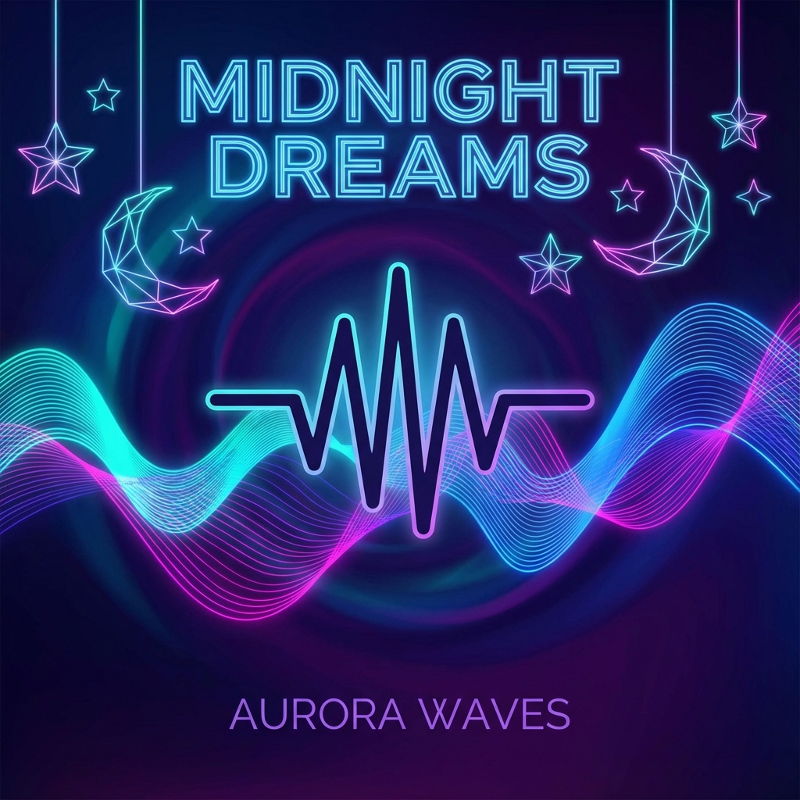

<div align="center">

# 🎵 Vibefy

### A Modern Music Streaming Website

**Beautiful design • Real audio playback • Premium experience**

[Live Demo](#-live-demo) • [Features](#-features) • [Tech Stack](#-tech-stack) • [Getting Started](#-getting-started)



</div>

---

## ✨ Overview

**Vibefy** is a fully-functional music streaming website featuring a stunning dark mode design, real audio playback, and a complete music player experience. Built with vanilla HTML, CSS, and JavaScript to showcase modern web development best practices.

### 🎯 Key Highlights

- 🎵 **Real Audio Streaming** - Working playback with royalty-free music
- 🎨 **Premium Dark UI** - Glassmorphism effects and vibrant gradients
- 🔍 **Live Search** - Real-time filtering across songs, artists, and genres
- 📱 **Fully Responsive** - Beautiful on mobile, tablet, and desktop
- ⌨️ **Keyboard Shortcuts** - Power-user friendly controls
- 💾 **Local Storage** - Persistent favorites and playlists

---

## 🎬 Live Demo

Open `index.html` in your browser to experience Vibefy:

```bash
# Simply open the file
open index.html

# Or use a local server (recommended)
python3 -m http.server 8000
# Then visit http://localhost:8000
```

---

## 🚀 Features

### Music Player
- ▶️ Play/pause with visual feedback
- ⏭️ Next/previous track navigation
- 🔀 Shuffle mode
- 🔁 Repeat modes (off, all, one)
- 🔊 Volume control with slider
- ⏱️ Seekable progress bar
- ❤️ Favorite/like tracks

### Browse & Discover
- 🎼 **Featured Tracks** - Curated song collection
- 💿 **Popular Albums** - Top albums with metadata
- 👤 **Top Artists** - Artist profiles with follower counts
- 🎭 **Browse by Genre** - 8 genre categories
- 📋 **Playlists** - Create and manage custom playlists

### User Experience
- 🔍 **Smart Search** - Filter by title, artist, album, or genre
- ⚡ **Instant Results** - Real-time search with debouncing
- 🎨 **Smooth Animations** - Micro-interactions throughout
- 🖱️ **Hover Effects** - Interactive card states
- 📱 **Mobile Optimized** - Touch-friendly interface

### Keyboard Shortcuts
| Key | Action |
|-----|--------|
| `Space` | Play/Pause |
| `→` | Next Track |
| `←` | Previous Track |
| `↑` | Volume Up |
| `↓` | Volume Down |

---

## 🛠️ Tech Stack

<div align="center">

| Technology | Purpose |
|------------|---------|
| **HTML5** | Semantic markup, Audio API |
| **CSS3** | Grid, Flexbox, Glassmorphism |
| **JavaScript ES6+** | Player logic, State management |
| **Font Awesome** | Icon library |
| **Google Fonts** | Inter typeface |

</div>

### Design Features
- Custom CSS variables for theming
- Backdrop filters for glassmorphism
- CSS Grid for responsive layouts
- CSS animations and transitions
- Custom scrollbar styling

---

## 📁 Project Structure

```
Antigravity/
├── index.html          # Main HTML structure
├── styles.css          # Complete design system & styles
├── app.js             # Music player logic & functionality
├── data.js            # Music database with streaming URLs
├── README.md          # This file
└── assets/            # Generated cover art & images
    ├── cover_*.png    # Album artwork
    └── artist_*.png   # Artist photos
```

---

## 🎯 Getting Started

### Prerequisites
- Modern web browser (Chrome, Firefox, Safari, Edge)
- No build tools required!

### Installation

1. **Clone or download** the repository:
```bash
git clone <your-repo-url>
cd Antigravity
```

2. **Open in browser**:
```bash
# Direct file
open index.html

# Or with a local server (recommended for CORS)
python3 -m http.server 8000
```

3. **Start listening!** 🎧

### Customization

#### Add Your Own Music
Edit `data.js` to add your tracks:

```javascript
{
    id: 7,
    title: "Your Song Title",
    artist: "Artist Name",
    album: "Album Name",
    duration: "3:45",
    genre: "Genre",
    coverArt: "path/to/cover.png",
    audioSrc: "https://your-audio-url.mp3"
}
```

#### Change Colors
Modify CSS variables in `styles.css`:

```css
:root {
    --color-primary: #667eea;      /* Main brand color */
    --color-secondary: #764ba2;    /* Secondary accent */
    --color-background: #0f1419;   /* Background color */
    /* ... */
}
```

---

## 🎨 Screenshots

### Desktop View
The main interface features a dark, modern aesthetic with glassmorphism:


### Player Controls
Full-featured player with all standard controls:
- Play/pause, skip, shuffle, repeat
- Volume slider with live adjustments
- Seekable progress bar
- Real-time playback updates

### Search Feature
Live search filtering across all metadata:
- Instant results as you type
- Matches titles, artists, albums, genres
- Smooth animations

---

## 🎵 Music Attribution

All music in this project is royalty-free and provided by:

**Kevin MacLeod** ([incompetech.com](https://incompetech.com))  
Licensed under Creative Commons: By Attribution 4.0 License

Tracks included:
- Slow Motion
- Inspired
- Fluffing a Duck
- Break Time
- Bit Quest
- Brandenburg Concerto No. 4 in G - 1st Movement

---

## 🔧 Development

### Code Features
- **ES6+ JavaScript** with modern syntax
- **Modular architecture** with clear separation of concerns
- **Event-driven** player state management
- **LocalStorage API** for data persistence
- **HTML5 Audio API** for media control
- **Debounced search** for performance

### Best Practices
✅ Semantic HTML5 elements  
✅ Accessible navigation and controls  
✅ SEO-optimized metadata  
✅ Mobile-first responsive design  
✅ Progressive enhancement  
✅ Clean, commented code  

---

## 🚀 Future Enhancements

- [ ] User authentication & profiles
- [ ] Backend integration for real music library
- [ ] Audio visualizer with Canvas API
- [ ] Lyrics display with sync
- [ ] Social features (share, follow)
- [ ] Advanced queue management
- [ ] Equalizer controls
- [ ] Offline mode with Service Workers
- [ ] Cross-fade between tracks

---

## 📄 License

This project is open source and available under the [MIT License](LICENSE).

Music files are licensed under Creative Commons: By Attribution 4.0 (see [Music Attribution](#-music-attribution)).

---

## 👨‍💻 Author

Created with ❤️ by **Your Name**

---

## 🙏 Acknowledgments

- **Kevin MacLeod** for providing royalty-free music
- **Font Awesome** for the icon library
- **Google Fonts** for the Inter typeface

---

<div align="center">

### ⭐ Star this project if you found it helpful!

**[View Live Demo](#) • [Report Bug](#) • [Request Feature](#)**

Made with 🎵 and ☕

</div>
